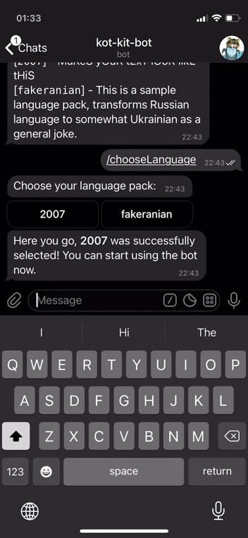
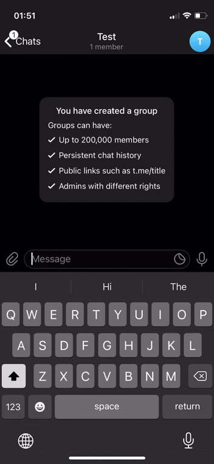

# Kot-Kit-Bot
Telegram bot that enables you to do inline translations of your messages for the sake of FUN.

## Screenshots

| Setting language:                 | Using in chat:                 |
| --------------------------------- | ------------------------------ |
|  |  |

## Little backstory

Back in March of 2020 (just when the whole COVID-19 thing started), I was in lockdown with my Ukrainian GF and I was bored and had absolutely nothing to do. At the time, we were exploring our language differences and I was trying to come up with a universal Russian-Ukrainian translation rulebook, as I was 99% certain there is some kind of logic behind it. I poked around, and found that someone already came up with a set of "rules" to transform the words by, which was a complete joke, although we did have a  blast translating random stuff with it. Naturally, I decided to automate it, and write a bot that will do the translation for me so I can casually throw some "fakeranian" in a conversation.

Fast-forward a few months, I made it a modular platform where more languages can be added and you can set the language you want to use in Telegram itself, dynamically adjusting your awesome sense of humour to different friend groups. 

## How to use
1. Open Telegram, find @KotKitBot and write `/help` to it. Follow the instructions there to set the language you want.
2. Go into any chat, start typing `@KotKitBot ` (space intended) and continue with your message. A "translation" will pop up as you stop typing. Tap on it to send it to your recipient.

## How to contribute
Contributions welcome! I will take care of hosting and deployment, but feel free to open a pull request with your "rulebook". Rules are simple:
* It has to be in JS/TS
* It has to comply with `IInput.ts` interface
* It needs to be added into `src/assets/index.ts`
